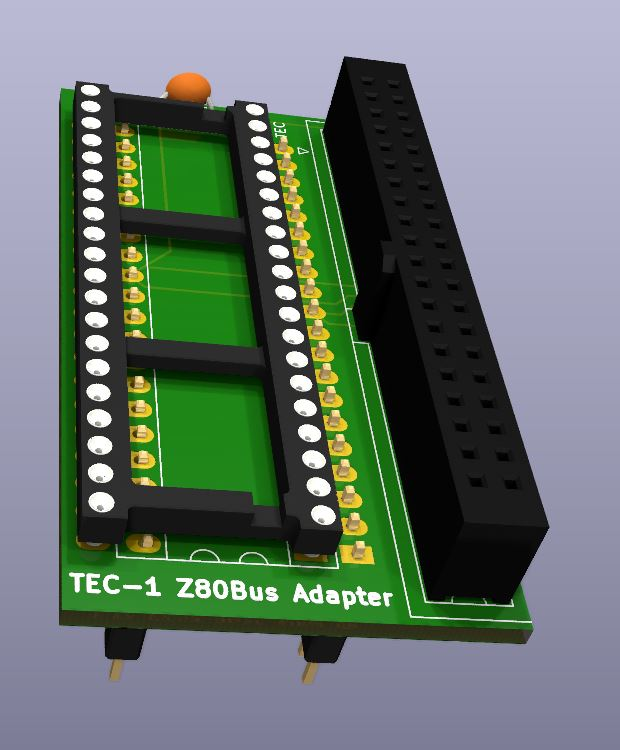
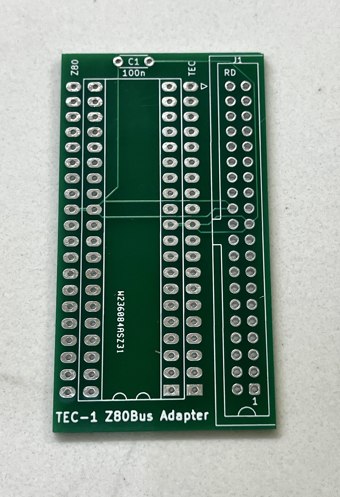
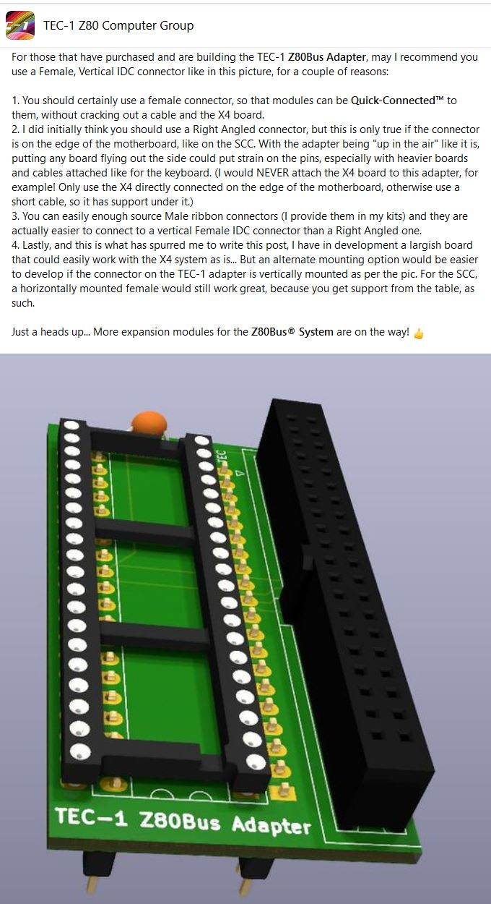

# TEC-1 Z80Bus Adapter

The current TEC-1F (ashamedly) and all its previous incarnations suffer from a difficult and awkward method of expansion, namely stacking things on top of the extra memory socket and then using fly leads to connect extra Z80 lines.

But with this Z80Bus Adapter, you can turn your tired old TEC-1 (or any Z80-based machine) into a new powerhouse of connectivity!

This is a render of what the finished result should look like, before soldering it into place on your motherboard.

## Assembly Instructions
1. If you are lucky enough to find out about the Z80Bus before you have soldered in either your Z80 or the 40 pin IC socket for your Z80, then you are one step ahead and saved yourself a lot of hassle desoldering the chip or socket. Some have suggested that you could leave an IC socket and jamb the long riser legs into it, but IDC cables and sockets are pretty stiff to plug and unplug, so my suggestion is to make it as firm as possible, and that means removing the existing Z80 or socket.

2. To build up the Z80Bus Adapter, you only need a handful of components:

| Component | Description |
|---|---|
| PCB | TEC-1 Z80Bus Adapter PCB. Get the Gerbers to print your own (use the PCBWay link below) or buy them off eBay.|
| 20mm Risers | 1 row of 80 pin risers 20mm high, cut into 2x 40 pins like these [on eBay](https://www.ebay.com.au/itm/283986436718)|
| 40pin Socket | 40 Pin IC socket for the Z80 |
| C1 | 100n Ceramic capacitor |
| IDC40F-RA | 40 pin female IDC socket, right angled  like this [at DigiKey](https://www.digikey.com.au/en/products/detail/sullins-connector-solutions/SFH11-PBPC-D20-RA-BK/1990101)|

3. <b>The order in which you assemble the adapter is important!</b> First you solder in the centre riser (the one that will be between the pins of the IC socket) from underneath the board, making sure only a minimum of the pins pokes through to the top of the board. Getting the risers soldered in straight and spaced correctly is the hardest part of this build. If possible, I would insert both risers into either another 40 pin socket or even into the Z80 holes of the motherboard (but don't solder them into the motherboard, yet!) just to help you align it all. Start with tacking in just one pin of the <b>ONE</b> riser between the pins of the Z80 socket. Make adjustments to make them parallel or line up if needed by heating up that one tacked pin, adjusting the position of the riser, letting it cool and checking the alignmernt. Once you are happy, solder in the pin on the other and of the same riser. Check alignment, again. Make adjustments as above, again. Then if all it lined up, solder in the rest of the 18 pins of this first riser.

4. The reason you only solder in one riser to start, is that the 40 pin IC socket might be difficult to solder in if both risers are installed. So next, after the first riser, you solder in the 40 pin socket for the Z80, taking note to orient the socket with the notch facing pin 1, as indicated on the silkscreen of the PCB. Again, I use a technique of tacking in two pins, on oposite ends of the socket, check that the sockets is flat to the board, heating the soldered pins if needed to make flat, then soldering the rest.

5. Next the second risers goes in, following the steps as per 3)... Tack it in, Check and adjust. Tack in a second pin. Check and adjust. Then solder the rest.

6. Although it's actually optional, there weren't enough decoupling capacitors on the old TEC-1, so it doesn't hurt to add one on this board.

7. Lastly solder in the 40 pin female IDC socket. I would suggest the use of a VERTICAL connector in this instance and this is what I supply in my full kits. (See the screenshot at the end of this article, copied from the FB post on the subject, as to the reasons for using a vertical connector.) Again, I do the same technique as with the risers, because these connectors can go a bit askew if you're not careful. Tack in one pin, check alignment and reheat that pin to move the socket to make it sit flat with the PCB. Once this is perfect, you can finish by soldering it the rest of the pins.

8. Finish up with some PCB cleaner to remove all the flux and you are done with assembly. But do be sure to check your soldering work carefully now that it is cleaned up, as once you do the next step, fixing any problem joints is VERY difficult!

9. The last step is of course soldering the Adapter into the location where the Z80 was on the motherboard. Be sure to orient it the correct way, with the IDC Z80Bus socket pointing off to the right on the TEC-1. Once again, the "tack one" (no pun intended) technique can be used to ensure the tall Z80Bus Adapter sits nice and perpendicular to the motherboard.

10. Check over your soldering, do a flux clean and then install the Z80 into the new tall socket of the Z80Bus adapter. Fire up your machine and it should act exactly as it used to. If not, check all your soldering work. You might have a dry joint or a bridge, somewhere.

With all that done, you should have a TEC-1 that looks similar to the picture below. Welcome to the Future of easy yet reliable connectivity!

I doubt anyone will get much out of the schematic, but [here it is](TEC-1_Z80Bus_Adapter_Schematic.pdf) for reference.

## Using Vertical Female Sockets on this Adapter

